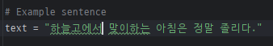
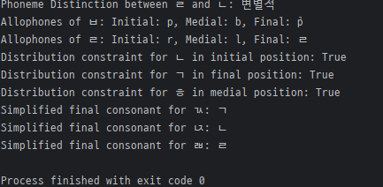

# Eumun
한국어 음운 분석기

## 사용법

그림처럼 예시 문장을 입력하면

다음과 같이 음운이 분석되는 도구입니다.

## 적용한 문법
__고등학교 수준__ 대부분의 문법을 사용하였으며, 주요 문법 규칙은 다음과 같습니다.

● 음절의 끝소리 규칙

● 비음화

● 유음화

● 구개음화

● 자음 축약, 모음 축약

● 된소리되기

● 사잇소리

## 사용한 라이브러리
● hgtk

● KoNLPy

● torch

● transformers
